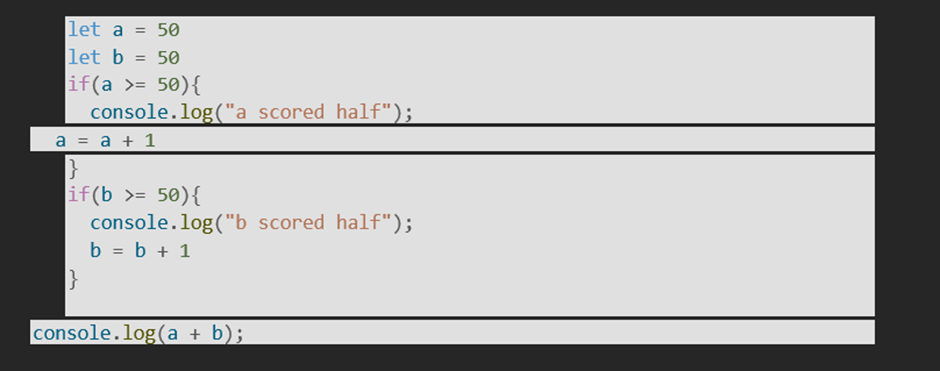

# __📁05.JAVASCRIPT Assignment-Condition💻__

### __1. Check if a number is positive or negative__
### Concept: if
### Problem:
### Write a program to check if a number is positive.
### Example:
### Input: 5 → Output: "Positive"

__Answer;__

*Concept*: `if` statements let you run code only when a condition is true.

### Check positive or negative
```
*JavaScript:*
let num = 5;
if (num > 0) {
  console.log("Positive");
} else if (num < 0) {
  console.log("Negative");
} else {
  console.log("Zero");
}
```
// Output: Positive
### __2. Check if a number is even or odd__
### Concept: if-else

__Answer;__
```
let num = 7;

if (num % 2 === 0) {
  console.log("Even");
} else {
  console.log("Odd");
}
```
// Output: Odd
### _3. Check if a person is eligible to vote
### Concept: if-else
### Age ≥ 18 → “Eligible” otherwise “Not eligible”.

|__Answer;__

*Concept*: `if-else` with a comparison operator `>=`

### Vote eligibility check
```
*JavaScript:
let age = 20;
if (age >= 18) {
  console.log("Eligible");
} else {
  console.log("Not eligible");
}
```
// Output: Eligible

### __4. Find the largest of two numbers__
### Concept: if-else

__Answer;__
```
let a = 12;
let b = 9;
if (a > b) {
  console.log(a + " is larger");
} else if (b > a) {
  console.log(b + " is larger");
} else {
  console.log("Both are equal");
}
```
// Output: 12 is larger
### __5. Find the largest of three numbers__
### Concept: if-else if-else

__Answer;__

*Concept*: `if-else if-else` chains let you test multiple conditions in order.

### Find largest of three numbers
```
JavaScript:
let a = 12;
let b = 25;
let c = 18;
if (a >= b && a >= c) {
  console.log(a + " is largest");
} else if (b >= a && b >= c) {
  console.log(b + " is largest");
} else {
  console.log(c + " is largest");
}
```
// Output: 25 is largest
### __6. Check if a character is a vowel or consonant__
### Concept: if-else if-else

__Answer;__

*Concept*: `if-else if-else` to test multiple character conditions

### Check vowel or consonant
```
*JavaScript:*
let char = 'e';
char = char.toLowerCase(); // handle uppercase too
if (char === 'a' || char === 'e' || char === 'i' || char === 'o' || char === 'u') {
  console.log("Vowel");
} else if (char >= 'a' && char <= 'z') {
  console.log("Consonant");
} else {
  console.log("Not a letter");
}
```
// Output: Vowel
1. Convert to lowercase first so `A` and `a` both work

2. Second check makes sure it's actually a letter - prevents `1` or `@` from being called "Consonant"

3. Vowels: `a, e, i, o, u`. Everything else a-z is consonant
### __7. Grade the student based on marks__
### Concept: if-else if-else
### Example:
### 90–100 → A
### 80–89 → B
### 70–79 → C
### else → Fail

__Answer;__
```
let marks = 85;

if (marks >= 90 && marks <= 100) {
  console.log("Grade A");
} else if (marks >= 80 && marks <= 89) {
  console.log("Grade B");
} else if (marks >= 70 && marks <= 79) {
  console.log("Grade C");
} else if (marks >= 0 && marks < 70) {
  console.log("Fail");
} else {
  console.log("Invalid marks");
}
```
// Output: Grade B
### __8. Check if a number is divisible by both 3 and 5__
### Concept: logical AND (&&)

__Answer;__
```
let num = 15;
if (num % 3 === 0 && num % 5 === 0) {
  console.log("Divisible by both 3 and 5");
} else {
  console.log("Not divisible by both");
}
```
// Output: Divisible by both 3 and 5

### __9. Check if a number is in a range (10 to 50)__
### Concept: logical AND (&&)

__Answer;__

*Concept*: Logical AND `&&` to check if a number meets both lower and upper bounds

### Check if number is in range 10 to 50
```
*JavaScript:*
let num = 25;
if (num >= 10 && num <= 50) {
  console.log("In range");
} else {
  console.log("Out of range");
}
```
// Output: In range
*Python:*

### Python bonus: you can also write it as
### if 10 <= num <= 50:
*How it works*: Both conditions must be true.  
- `25 >= 10` → true  
- `25 <= 50` → true  
- `true && true` → "In range"

*Test it:*
- `num = 10` → "In range" - boundaries included
- `num = 50` → "In range" 
- `num = 9` → "Out of range"
- `num = 51` → "Out of range"

### __10. Check if a year is a leap year__
### Concept: combined conditions (&&, ||)

__Answer;__

*Concept*: Combined conditions with `&&` and `||` - leap years have specific rules

### Check if a year is a leap year

*Leap year rules:*
1. Divisible by 400 → leap year
2. Divisible by 4 but NOT by 100 → leap year
3. Everything else → not leap

*JavaScript:*
```
let year = 2024;
if (year % 400 === 0 || (year % 4 === 0 && year % 100 !== 0))
 {
  console.log(year + " is a leap year");
} else {
  console.log(year + " is not a leap year");
}
```
// Output: 2024 is a leap year

*Test cases:*
- `2000` → leap - divisible by 400
- `1900` → not leap - divisible by 100 but not 400  
- `2024` → leap - divisible by 4, not by 100
- `2023` → not leap

*Why the parentheses*: `&&` runs before `||`, so we group `year % 4 == 0 && year % 100 != 0` to check that combo first.

### __11. Display day name based on day number__
### Concept: switch
### 1 → Monday
### 2 → Tuesday …
### 7 → Sunday

__Answer;__
```
let day = 3;
switch(day) {
  case 1:
    console.log("Monday");
    break;
  case 2:
    console.log("Tuesday");
    break;
  case 3:
    console.log("Wednesday");
    break;
  case 4:
    console.log("Thursday");
    break;
  case 5:
    console.log("Friday");
    break;
  case 6:
    console.log("Saturday");
    break;
  case 7:
    console.log("Sunday");
    break;
  default:
    console.log("Invalid day number");
}
```
// Output: Wednesday
### __12. Basic Calculator (Add, Subtract, Multiply, Divide)__
### Concept: switch
### Inputs: number1, number2, operator (+, -, *, /)

__Answer;__
```
let num1 = 12;
let num2 = 4;
let operator = '/';
let result;
switch(operator) {
  case '+':
  result = num1 + num2;
    break;
  case '-':
    result = num1 - num2;
    break;
  case '*':
    result = num1 * num2;
    break;
  case '/':
    if (num2 !== 0) {
      result = num1 / num2;
    } else {
      result = "Error: Division by zero";
    }
    break;
  default:
    result = "Invalid operator";
}
console.log("Result:", result);
```
// Output: Result: 3
### __13. Check if a number is zero, positive, or negative__
### Concept: if-else if-else

__Answer;__
```
let num = -7;
if (num > 0) {
  console.log("Positive");
} else if (num < 0) {
  console.log("Negative");
} else {
  console.log("Zero");
}
```
// Output: Negative
### __14. Check if a student passed or failed__
### Marks ≥ 40 → Pass
### Else → Fail

__Answer;__
```
let marks = 65;
if (marks >= 40) {
  console.log("Pass");
} else {
  console.log("Fail");
}
```
// Output: Pass
### __15. Check if the person has a fever (normal temperature: 98.6F)__

__Answer;__
```
let temp = 99.2;
if (temp > 98.6) {
  console.log("Has a fever");
} else {
  console.log("Normal temperature");
}
```
// Output: Has a fever

### __16. Check if someone has normal temperature: Normal temp= (98 to 98.9)__

### 98.1 => normal

### 99 => not normal

### 97.9 => not normal

__Answer;__

*Concept*: Range check with `&&` - temp must be between 98 and 98.9 inclusive

### Normal temperature check: 98°F to 98.9°F
```
*JavaScript:*

let temp = 98.1;
if (temp >= 98 && temp <= 98.9) {
  console.log("Normal");
} else {
  console.log("Not normal");
}
```
// Output: Normal

*Test cases:*
- `98.1` → Normal - inside range

- `99` → Not normal - above 98.9

- `97.9` → Not normal - below 98

- `98` → Normal - lower boundary included

- `98.9` → Normal - upper boundary included

Python lets you chain comparisons `98 <= temp <= 98.9`. In JS you need `&&` to combine both checks.
### __17. You need to have 75% attendance to write the exam. Take the total number of classes and the number of attendances from the student and tell him if he can write the exam__
```
let totalClasses = 50;
let attended = 36;
if (totalClasses === 0) {
  console.log("Error: Total classes cannot be zero");
} else {
  let percentage = (attended / totalClasses) * 100;
  if (percentage >= 75) {
    console.log(`Attendance: ${percentage.toFixed(1)}%. Eligible for exam.`);
  } else {
    let needed = Math.ceil(totalClasses * 0.75 - attended);
    console.log(`Attendance: ${percentage.toFixed(1)}%. Not eligible. Need ${needed} more classes.`);
  } 
}
```
// Output: Attendance: 72.0%. Not eligible. Need 2 more classes.
### __18. If(5>4)__
### {
### Console.log(“First if”)
### }
### If(10 >= 6){
### Console.log(“Second if”)
### }
### What will the output of the above code be?


__Answer:__
Both `if` statements are separate, so both get checked.

*Output:*

First if

Second if

*Why*: 

1. `5 > 4` is `true` → prints "First if"

2. `10 >= 6` is `true` → prints "Second if"

These aren’t `if-else if` linked together. They’re two independent `if` blocks. Each one runs if its condition is true, regardless of what the other does.

If it were `if...else if`, only the first true block would run.
### __19. If(true)__{
### Console.log(“1”)
### }
### If(false){
### Console.log(“2”)
### }
### If(true){
### Console.log(“3”)
###   }
### What will the output of the above code be?

__Answer:__

Each `if` is independent. Only the ones with `true` run.

*Output:*

1

3

1. `if(true)` → runs → prints "1"

2. `if(false)` → skips → nothing prints  

3. `if(true)` → runs → prints "3"

No `else` linking them, so every `true` condition executes. `false` conditions get ignored.
### __20. What will be the output of the below code?__

```
let a = 50
let b = 50
if(a >= 50){
  console.log("a scored half");
  a = a + 1
}
if(b >= 50){
  console.log("b scored half");
  b = b + 1
}
console.log(a + b);
```
*Output:*

a scored half

b scored half

102

*Why:*
1. `a = 50`, so `a >= 50` is `true` → prints `"a scored half"`, then `a` becomes `51`

2. `b = 50`, so `b >= 50` is `true` → prints `"b scored half"`, then `b` becomes `51` 

3. Final line: `console.log(51 + 51)` → prints `102`

Both `if` blocks are independent, so both run. The variables get updated inside each block before the final sum.
### __21. Write a chained if / else-if statement to fill in the following conditions__
### val  < 5  =>  Tiny

### val  < 10  =>  Small

### val  < 15  =>  Medium

### val  < 20  => Large

### val  >= 20  => Huge 

Answer:
```
let val = 12;
if (val < 5) {
  console.log("Tiny");
} else if (val < 10) {
  console.log("Small");
} else if (val < 15) {
  console.log("Medium");
} else if (val < 20) {
  console.log("Large");
} else {
  console.log("Huge");
}
```
// Output: Medium
### __22. Use the switch case and create an application with the following roles.__
### admin => gets full access

### subAdmin => gets access to create and delete courses

### testPrep => gets access to create and delete tests

### user => gets access to consume contents

__Answer;__
```
let role = "subAdmin";

switch (role) {
  case "admin":
    console.log("Full access");
    break;
  case "subAdmin":
    console.log("Access to create and delete courses");
    break;
  case "testPrep":
    console.log("Access to create and delete tests");
    break;
  case "user":
    console.log("Access to consume contents");
    break;
  default:
    console.log("Invalid role. No access");
}
```
// Output: Access to create and delete courses
### __23. Guess the output__
### let a = 5, b = 10;

### if (a > b && b > 0) {

   ### console.log("X");

 ### } else {

  ###  console.log("Y");
### }

__Answer;__

"Y"
### __24. Guess the output__
### let day = 3;

### switch(day) {

  ###  case 1: console.log("Mon"); break;

  ### case 2: console.log("Tue"); break;

  ###  case 3: console.log("Wed"); break;

  ###  default: console.log("Invalid");
### }
__Answer:__
*Output:*
"Wed"
*Why*: `day = 3`, so it matches `case 3`. It runs `console.log("Wed")`, then hits `break` and exits the switch. 

Without `break`, it would fall through to the next cases. But here `break` stops it right after printing.
### __25. Create a simple ATM withdrawal checker__
### Conditions:

### Balance should be greater than withdrawal amount

### AND amount should be a multiple of 100
__Answer:__
```
let balance = 2500;
let withdrawal = 500;

if (balance >= withdrawal && withdrawal % 100 === 0) {
  balance = balance - withdrawal;
  console.log(`Withdrawal successful. New balance: ${balance}`);
} else if (withdrawal % 100 !== 0) {
  console.log("Error: Amount must be multiple of 100");
} else {
  console.log("Error: Insufficient balance");
}
```
// Output: Withdrawal successful. New balance: 2000


